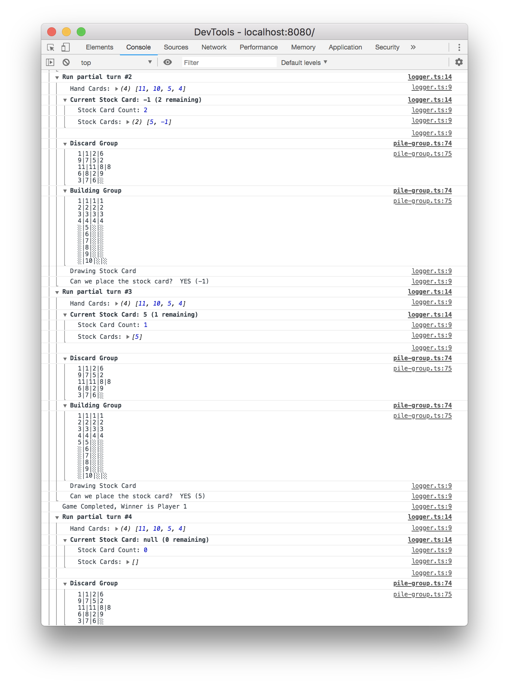

# Skip Bo in JS

Start with `npm run develop` and you see the following output:

Run `npm run test` to see all tests passing. Look into the test files
to get a feeling what's happening in my implementation.

The game is run by an automator for demonstrating and developing purposes.
Many edge cases missing but it usually completes within a sane amount of rounds
using the following strategy:

+ Fill your hand when the turn stated once
+ Fill your hand if your hand if you run out of cards during your turn but before discarding a card (which completed the turn)

Repeat:
+ Try to place the stock card in the building pile
+ Try to place a hand card in the building pile
+ Try to place a discarded card in the building pile.
+ Repeat if any of the three worked if not complete the turn.

+ Complete the turn by discarding your left-most (first in list) hand card

+ Building Piles are naively build — search the first fitting and place the card
+ Discard Piles are evenly build — stack on top of the smallest pile.

That's it.

Technically I'm using different implementation for building and discarding piles. A doubly linked list makes it easier to handle the lists.

Notes to myself are following:
---
## AI
https://github.com/rsms/js-lru
https://github.com/7imon7ays/concentration-js/blob/master/js/dev/concentration.js

## Actions
shuffle deck

A Player Turn
+ Refill hands with 5 cards
+ try stock pile -> building pile
+ try discard pile -> building pile
+ immediately refill if no hand cards left
+ complete turn by discarding a card (no refill if cards are zero)
+ win if stock pile empty

-> next player, next turn

## Rules
// 144 1-12 cards  + 18 Joker/Wild (Skip-bo) = 162 cards
// empty stock pile to win.
// draw pile in center
// 4 building piles in the center
// 4 discard piles per player

// 2 -4 players: 30 cards per player -> stock pile
// 5 or more: 20 cards per player dealt -> stock pile
// face down

// 1. shuffle deck

// 12 cards per face
